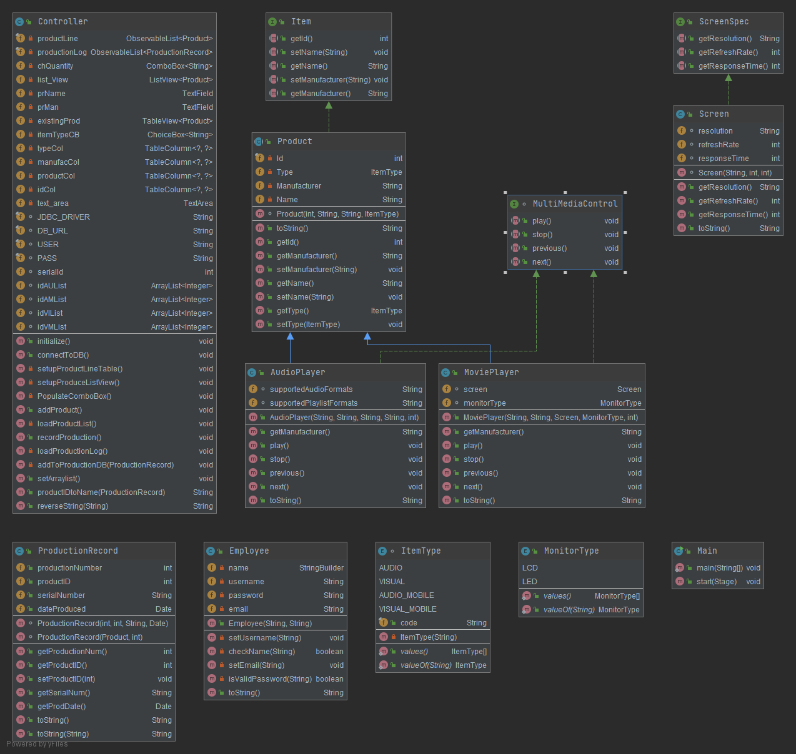

# OOP_Semester_Project_WH

This is a production recording GUI.  
Author: William Howell  
Last Updated: 12/3/2020
This was made as an assignment from my COP 3003 class at
Florida Gulf Coast University. The assignment was a semester 
long project that we built on in "sprints" like a production.
It taught us how to create a GUI, Database, and the basics of OOP.
I had a lot of frustration through creating this but in the end this
is the culmination of all of my work. I'm glad I went through it 
and even though I had a lot of tough times I had a lot of fun and
highs from the work.

#####Demonstration

#####Javadocs

#####Diagram
